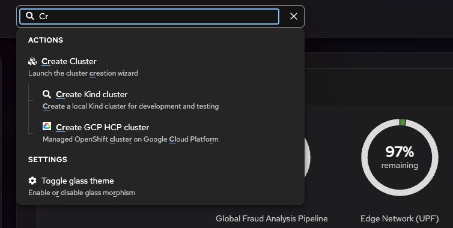
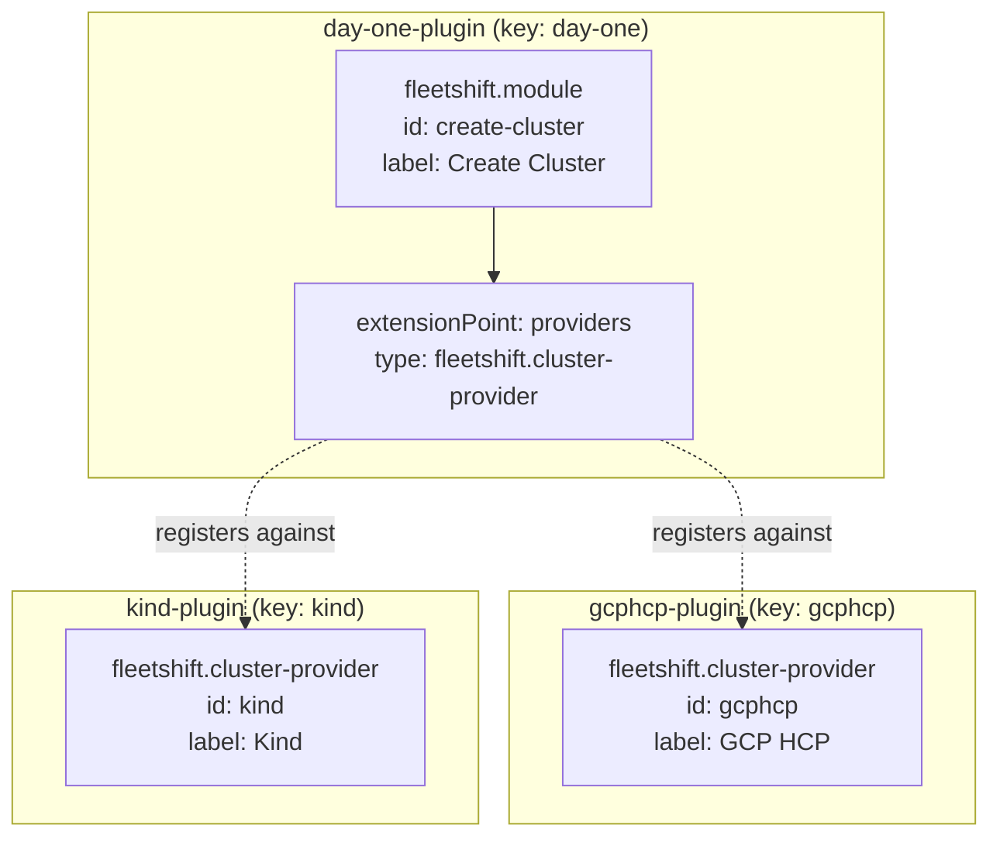
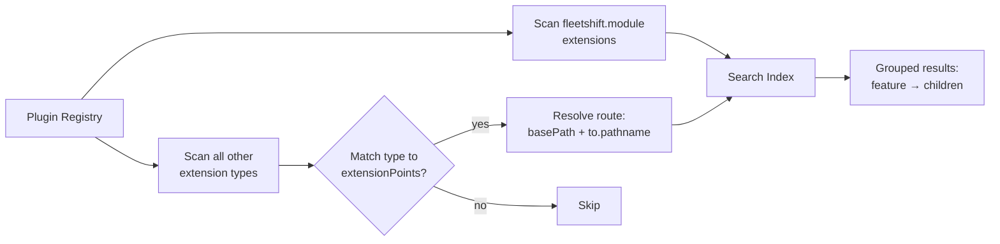
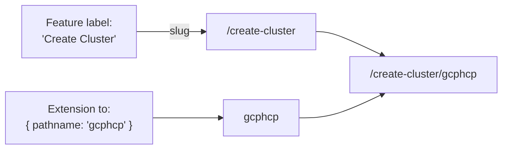

# Feature Contracts — Plugin Extension Points and Automated Search

**Jira:** [OME-102](https://redhat.atlassian.net/browse/OME-102)
**Epic:** [OME-3 — Addon / Extension Model](https://redhat.atlassian.net/browse/OME-3)
**Status:** Draft

## Context

FleetShift's UI is a plugin shell — plugins contribute pages, wizards, and actions via extension types like `fleetshift.module`. We are building a global search capability from scratch that lets users discover available UI features (pages, actions, sub-features) without navigating the menu tree.

## Search Wireframe



Features and their extensions are grouped in a tree: the parent feature ("Create Cluster") with child extensions ("Create Kind cluster", "Create GCP HCP cluster") indented beneath it. The search index is built from plugin extension metadata — each `fleetshift.module` declares `id`, `description`, `keywords`, and `extensionPoints` which the shell indexes automatically.

## Goal

New plugin features should be automatically discoverable via search based on the plugin registry alone — no separate search metadata required.

Each `fleetshift.module` should declare enough metadata (stable ID, description, keywords, extension points) that the shell can:
1. Automatically index it for search
2. Allow other plugins to extend it with a formal contract
3. Compose routes from the feature graph

The search index becomes a **projection of the plugin feature graph** rather than a manually maintained parallel structure.

## Types

### Navigation

The `to` type used throughout this model is the same `PluginNavigateTo` used by the routing plugin (`PluginLink`, `usePluginNavigate`). All paths are **relative to the parent feature's base path**.

```typescript
/**
 * Relative navigation target — same shape as the routing plugin's `to` prop.
 * Paths are relative to the feature's base path (resolved from label slug).
 */
interface PluginNavigateTo {
  pathname?: string;
  search?: string;
  hash?: string;
}
```

**Hash fragment contract (future work):** `hash` deep-linking is planned but not yet implemented — current route composition uses `pathname` and `search` only. When implemented, a `to` with `hash` (e.g., `{ hash: "notifications" }`) will scroll to a matching element ID in the target page.

```typescript
// Future: deep-link to the "Notifications" section of the Settings page
{
  "to": { "pathname": "settings", "hash": "notifications" }
}
// → would navigate to /settings#notifications
// → target page must have <h2 id="notifications">Notifications</h2> or similar
```

### Feature Declaration

A `fleetshift.module` becomes a **feature declaration**. It gets an explicit, stable `id` and can advertise extension points by naming a custom extension type.

```typescript
/**
 * A feature declaration — a `fleetshift.module` with enough metadata
 * for automatic search indexing and cross-plugin extension.
 */
/**
 * Valid extension ID: lowercase letters, digits, and dashes.
 * Must start with a letter. Examples: "create-cluster", "auth-setup".
 */
type ExtensionId = string; // /^[a-z][a-z0-9-]*$/

interface FeatureDeclaration {
  /**
   * Local identifier within the plugin.
   * Must match /^[a-z][a-z0-9-]*$/ (letters, digits, dashes; starts with a letter).
   * The shell composes the global feature ID as `{key}.{id}`,
   * e.g. plugin key "day-one" + id "create-cluster" → "day-one.create-cluster".
   */
  id: ExtensionId;
  /** Display name (also used as search title) */
  label: string;
  /** Module component */
  component: CodeRef;
  /** Human-readable summary (used in search results) */
  description?: string;
  /** Search keywords for discoverability */
  keywords?: string[];
  /**
   * Named extension points this feature accepts.
   * Each key maps to an extension type string that other plugins register against.
   * Optional — a feature without extension points is still searchable but not
   * extendable by other plugins. Developers can define custom search entries
   * for such features using the reserved search properties directly on the module.
   */
  extensionPoints?: Record<string, ExtensionPointDeclaration>;
}

interface ExtensionPointDeclaration {
  /** Human-readable description of what this extension point accepts */
  description: string;
  /** The extension type string plugins use to contribute to this point */
  type: string;
}
```

### Extension Types

Each extension point defines its own extension type (e.g., `fleetshift.cluster-provider`). The type determines domain-specific properties — a cluster provider has a `card`, `wizard`, and `icon`; a different extension point would have different properties.

Search is a **cross-cutting concern**. Any extension type can include a reserved `searchResult` property to customize how it appears in search. The shell indexes all extensions automatically from their `label`, `description`, and `keywords`.

```typescript
/**
 * Props the shell passes to a custom search result component.
 */
interface SearchResultProps {
  title: string;
  description: string;
}

/**
 * Reserved properties available on any extension type for search customization.
 * These are mixed into the domain-specific extension properties.
 */
interface SearchReservedProperties {
  /** Custom search result component — receives { title, description } */
  searchResult?: CodeRef<ComponentType<SearchResultProps>>;
  /** Custom search result icon — rendered with no props */
  searchIcon?: CodeRef<ComponentType>;
}
```

## Feature Graph

The plugin registry forms a directed graph: plugins declare features (`fleetshift.module`), features declare extension points, and other plugins contribute extensions against those points.



## Search Index Build Flow

The shell reads the plugin registry and builds a flat search index with parent–child relationships preserved via the `feature` field.



## Route Composition

Extension routes are composed by combining the feature's base path with the extension's relative `to`.



## Example: Cluster Creation

The "Create Cluster" page lives at `/create-cluster` (slug derived from label). It shows a list of available cluster providers. Selecting a provider navigates to a sub-path like `/create-cluster/gcphcp`. Provider plugins extend this feature by registering a `fleetshift.cluster-provider` extension.

### Feature: Create Cluster page (day-one-plugin)

Plugin key: `"day-one"`, extension id: `"create-cluster"` → global feature ID: `"day-one.create-cluster"`

```json
{
  "type": "fleetshift.module",
  "properties": {
    "id": "create-cluster",
    "label": "Create Cluster",
    "component": { "$codeRef": "CreateClusterPage.default" },
    "description": "Launch the cluster creation wizard",
    "keywords": ["deploy", "new", "cluster", "wizard"],
    "extensionPoints": {
      "providers": {
        "description": "Cluster providers available in the creation wizard",
        "type": "fleetshift.cluster-provider"
      }
    }
  }
}
```

The Go backend resolves the route: `"Create Cluster"` → slug `create-cluster` → base path `/create-cluster`. The shell composes the global feature ID from the plugin registry key and the extension's local `id`.

### Extension: GCP HCP provider (gcphcp-plugin)

The extension type is `fleetshift.cluster-provider` — matching the extension point declaration. Domain-specific properties (`card`, `wizard`) are defined by the extension point contract. Search properties (`searchResult`, `searchIcon`) are reserved and handled by the shell.

```json
{
  "type": "fleetshift.cluster-provider",
  "properties": {
    "id": "gcphcp",
    "label": "GCP HCP",
    "description": "Managed OpenShift cluster on Google Cloud Platform",
    "keywords": ["gcp", "google cloud", "hosted control plane", "managed"],
    "to": { "pathname": "gcphcp" },

    "icon": { "$codeRef": "GcpHcpProviderCard.GcpHcpIcon" },
    "card": { "$codeRef": "GcpHcpProviderCard.default" },
    "wizard": { "$codeRef": "CreateGcpHcpWizard.default" },

    "searchResult": { "$codeRef": "GcpHcpSearchResult.default" },
    "searchIcon": { "$codeRef": "GcpHcpProviderCard.GcpHcpIcon" }
  }
}
```

The `to` is relative — `{ pathname: "gcphcp" }` resolves to `/create-cluster/gcphcp`. This is the same `to` you'd pass to `PluginLink` or `usePluginNavigate`:

```tsx
<PluginLink scope="day-one-plugin" module="CreateClusterPage" to="gcphcp">
  GCP HCP
</PluginLink>

// equivalent to navigating to /create-cluster/gcphcp
```

### Extension: Kind provider (kind-plugin)

No custom search component — the shell renders the default search result using `label` and `description`.

```json
{
  "type": "fleetshift.cluster-provider",
  "properties": {
    "id": "kind",
    "label": "Kind",
    "description": "Create a local Kind cluster for development and testing",
    "keywords": ["kind", "local", "development", "testing"],
    "to": { "pathname": "kind" },

    "icon": { "$codeRef": "KindProviderCard.KindIcon" },
    "card": { "$codeRef": "KindProviderCard.default" },
    "wizard": { "$codeRef": "CreateKindWizard.default" }
  }
}
```

Resolves to `/create-cluster/kind`.

### How the shell builds the search index

1. Reads `fleetshift.module` extensions from the plugin registry
2. For plugin key `"day-one"`, extension id `"create-cluster"` → registers feature `"day-one.create-cluster"` with title "Create Cluster", description, keywords, route `/create-cluster`
3. Reads all other extension types and matches them to features via extension point declarations
4. For GCP HCP `fleetshift.cluster-provider`: the shell knows `fleetshift.cluster-provider` belongs to `"day-one.create-cluster"` (from its `extensionPoints`). Resolves base path `/create-cluster` + `to.pathname` → `/create-cluster/gcphcp`. Inserts child search entry grouped under the parent. Uses `searchResult` and `searchIcon` if provided, otherwise renders default.
5. Same for Kind → `/create-cluster/kind`

Search result for "cluster":
```
Pages
  Create Cluster — Launch the cluster creation wizard
  ├── GCP HCP — Managed OpenShift cluster on Google Cloud Platform
  └── Kind — Create a local Kind cluster for development and testing
```

## Route Resolution

The Go backend generates page slugs from labels:

```go
slug := strings.Trim(slugRe.ReplaceAllString(strings.ToLower(label), "-"), "-")
```

Route composition for extensions:

| Component | Source | Example |
|-----------|--------|---------|
| Base path | Feature label → slug | `/create-cluster` |
| Extension path | `to.pathname` (relative) | `gcphcp` |
| Full path | base + `/` + extension | `/create-cluster/gcphcp` |
| Query params | `to.search` | `?provider=gcphcp` |
| Hash fragment | (planned) `to.hash` | `#notifications` |

This matches the routing plugin's resolution: `PluginLink` and `usePluginNavigate` already compose paths as `${basePath}/${to.pathname}`.

### Routing Convention

Extensions should prefer defining their own `fleetshift.module` (own top-level route) over using relative `to` paths under a parent feature. Relative child routing only makes sense when the parent page renders an `<Outlet>` — i.e., the parent explicitly supports nested content.

| Pattern | When to use | Example |
|---------|-------------|---------|
| Own `fleetshift.module` | Extension is a standalone page (no `<Outlet>` in parent) | Signing Keys page at `/signing-keys` |
| Relative `to` under parent | Parent page renders child content via `<Outlet>` | GCP HCP wizard at `/create-cluster/gcphcp` |

If an extension declares a relative `to` but the target feature's page has no `<Outlet>`, the child route will never render. Developers should check the parent feature's contract before using relative paths.

## Required Changes

### Backend: dot-separated feature IDs

The Go backend currently composes page IDs with a dash (`fmt.Sprintf("%s-%s", entry.Key, strings.ToLower(moduleName))`). This must change to a dot separator (`%s.%s`) to match the `{key}.{id}` format. The dot makes the boundary between plugin key and extension ID unambiguous — with dashes, `"day-one-create-cluster"` could split multiple ways.

Affected code: `generatePluginPages` in `fleetshift-server/internal/transport/http/uiconfig.go`. The nav layout and user-config responses will reflect the new format automatically since they derive from the same function.

## Open Questions

- [ ] **Backend awareness of extension points (post-POC):** For now, extension points are resolved purely in the UI shell at runtime. In the future, the backend addon registration API could also track extension points — enabling validation (reject unknown types), discovery (query available extension points), and dependency ordering. Not in scope for the initial POC milestone, but worth keeping in mind as the addon model (OME-3) matures.
- [ ] **Developer tooling for the feature graph (post-POC):** The feature graph is internal — end users see pages and actions, not extensions. A developer-facing tool (MCP server, CLI skill, or Claude Code agent) that queries the graph ("show all extensions registered against `day-one.create-cluster`") would improve the plugin developer experience. Could also power the `/debug` console. Not POC scope.
- [ ] **Non-page features (settings, toolbar actions):** Most non-page features are core platform concerns. If the feature has a page (e.g., Settings), search navigates there via normal routing. Hash fragments (`#section-id`) can deep-link to a specific section — the contract is that a `to` with a hash (e.g., `{ pathname: "settings", hash: "notifications" }`) requires a matching heading ID in the target page. Note: `hash` support is not yet implemented in the routing runtime. Toolbar actions (e.g., "Toggle glass theme") are trickier — selecting them in search would need to trigger a callback rather than a navigation. Needs design for action-type results.
- [ ] **Inline actions from search:** Should some search results trigger actions directly (e.g., toggling a theme, opening a modal) rather than navigating? This is a UX question — command palette patterns (VS Code, Spotlight) do this, but it adds complexity and may confuse users who expect search to mean "find and go to". Needs UX input.
- [ ] **Build-time validation of extension `to` params (post-POC):** A future FleetShift plugin SDK (wrapping the dynamic plugin SDK) could validate at build time that an extension's `to` params match the target feature's contract — e.g., that the parent feature declares an `<Outlet>` if a relative path is used. Runtime validation in the shell is also possible but less useful (the plugin is already built and shipped). SDK-level validation is the right layer for this.
- [ ] **Feature visibility and permissions (post-POC):** Features and extensions should respect the platform's RBAC model — a feature can declare a required permission (e.g., `"requires": "clusters.create"`) and the shell only shows it in search and navigation if the current user has that permission. This follows the same pattern as the rest of the platform's access control and will be designed alongside it. Not in POC scope.
- [ ] **Reserved property enforcement:** `searchResult` and `searchIcon` are reserved across all extension types. The future SDK should enforce this at build time — error if a domain extension type redefines them with an incompatible signature. At runtime, the server should discard extensions that reference features which don't exist or aren't enabled for the current user.

## Relationship to Addon Model (OME-3)

The addon/extension model (OME-3) covers the full lifecycle: registration, discovery, delivery. Feature contracts are the **UI-facing slice** — how addons surface capabilities in the shell. An addon registers with the management plane (backend), and its UI plugin declares features and extensions that the shell indexes for search and navigation.

The feature contract model should be designed so that when the addon registration API lands, a registered addon's UI plugin can declare its features and have them automatically discoverable via search.
